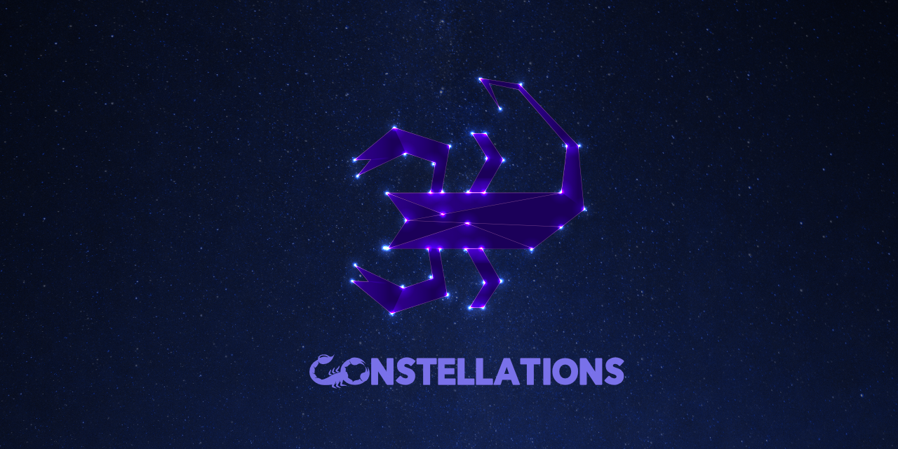

<p align="center"></p>

# Constellations

[constellations.sh](https://constellations.sh) by [scorpion.io](https://scorpion.io) will allow orchestration of open source projects.

Please see the [Constellations GitHub](https://github.com/scorpion/constellations) repository for more information.

## CLI

To use _constellations_, you will need to install the [scorpion CLI](https://github.com/scorpion/cli).

### Asterism

An asterism is a suggestion on how to run your constellation and gives a starting point on builing your infrastructure and framework. You would run the following at the command line.

```bash
scorpion co cmf
```

> `co` = short for constellation

That would provision the core _CMF_ foundation and creates a `constellation.toml` file.

Please see [constellations.sh](https://constellations.sh) for more information on the CMF and future constellations.

### Images

These are the currently supported docker images that serve as the foundations and building blocks for an asterism.

- [PHP](https://github.com/scorpion/php)
- [Neo4j](https://github.com/scorpion/neo4j)

### constellation.toml

`scorpion co` will either provision a constellation based on the `constellation.toml` file, or it will generate a pre-defined constellation called an asterism.

Standard will be based on [TOML](https://toml.io/en/) formatting.

Standards proposal for `asterism format v0.1.0` will appear here when the issue is opened.

### Future Plans

If you want to build something really cool with us, we want to include you in our community! We will be working with and accepting pull requests for various projects.

Get in touch: <brett@scorpion.io>
